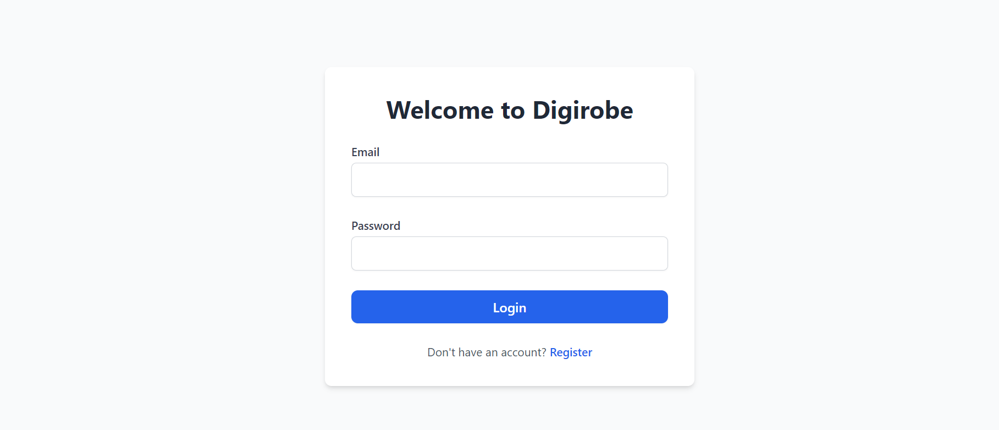

# Digirobe - Your Smart Digital Wardrobe

**Live Demo:** [https://digirobe.netlify.app/](https://digirobe.netlify.app/)

## The Story Behind Digirobe

This project was born from a common, everyday problem: a wardrobe full of clothes, but a recurring feeling of having nothing to wear. I found myself repeatedly wearing the same few outfits, while dozens of other clothing items sat unused. Packing for trips was a time-consuming process of digging through suitcases, trying to piece together outfits.

I wanted a solution that was accessible, intelligent, and would help me make the most of what I already own. The idea was simple: what if I could have my entire wardrobe on my phone?

**Digirobe** is the result of that idea. It's a full-stack web application designed to be a smart, digital closet. It not only helps you keep track of your clothes but also acts as a personal stylist, suggesting outfits for any occasion. This project is a demonstration of building a modern, secure, and feature-rich application from the ground up, solving a real-world problem with technology.

## Key Features

* **Secure User Authentication:** Full registration and login system using JWT (JSON Web Tokens), ensuring each user has their own private, secure wardrobe.
* **Digital Wardrobe Management:** Easily add, view, and categorize all your clothing and accessories. Each item includes details like brand, size, price, and a photo.
* **AI-Powered Outfit Suggester:** Leveraging the **Google Gemini API**, the app can suggest complete, head-to-toe outfits for any occasion you describe (e.g., "casual coffee date," "job interview").
* **Laundry Tracking:** Move items to a virtual laundry basket so you know what's clean and what's not. A "Wash All" feature makes it easy to manage.
* **Persistent Cloud Storage:** All user data and images are securely stored in a cloud-hosted PostgreSQL database, ensuring data is never lost.
* **Fully Responsive UI:** A clean, modern, and intuitive user interface built with React and Tailwind CSS that works seamlessly on both desktop and mobile devices.
* **PWA Enabled:** The application can be added to a mobile device's home screen, providing a native-app-like experience without the need for an app store.

## Tech Stack & Architecture

This project is a full-stack application built with a modern, industry-standard technology stack.

### Backend (`digirobe-backend`)
* **Framework:** Spring Boot 3
* **Language:** Java 17
* **Security:** Spring Security 6, JSON Web Tokens (JWT)
* **Database:** Spring Data JPA (Hibernate) with a PostgreSQL database
* **API:** RESTful API architecture
* **Deployment:** Packaged as a Docker container and deployed on Render

### Frontend (`digirobe-frontend`)
* **Framework:** React 18
* **Styling:** Tailwind CSS
* **Icons:** Lucide React
* **Deployment:** Deployed on Netlify with continuous deployment from GitHub

### Artificial Intelligence
* **Model:** Google Gemini API for natural language understanding and outfit generation.

